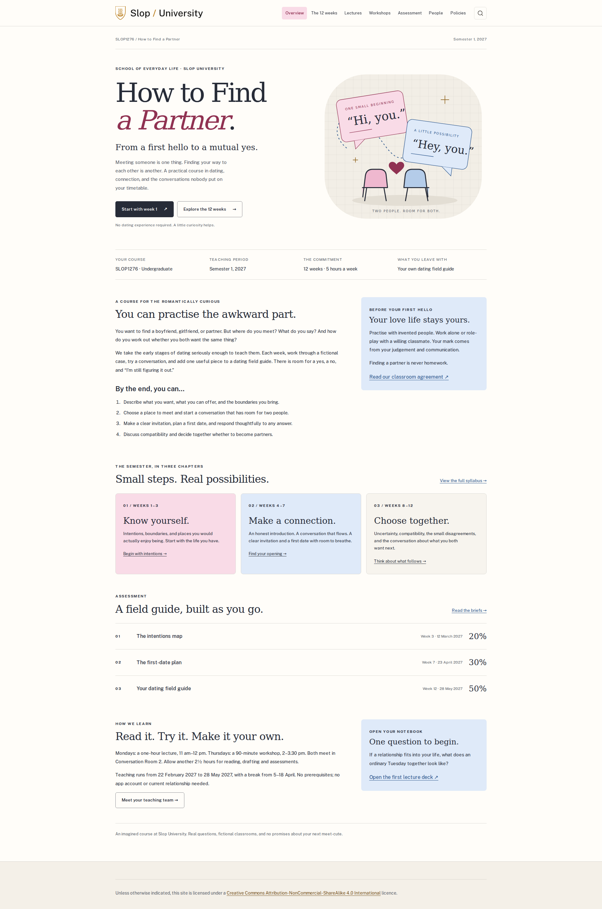

# First prototype: direction and evidence

This is an agent-maintained working record, not the student's PROCESS.md.

The student's request was: “For this assignment, I want to choose the topic:
\"How to find a partner\" which is how to find a boyfriend or girlfriend as the
course. The theme colour should be pink and blue.”

The proposed scope is the early dating journey, from a first hello to deciding
whether to become partners. The title remains **How to Find a Partner**,
SLOP1276. Pink and blue are course accents; the institutional tokens and marks
remain fixed. Colour never labels a gender. This direction awaits the student's
review of the rendered prototype.

## What the course promises

Students build a dating field guide using fictional cases. Each week contributes
a different decision: intentions, boundaries, places to meet, introductions,
conversation, invitations, first dates, uncertainty, compatibility, disagreement,
defining a relationship, then an integrated case. Assessments are an intentions
map (20%, week 3), an invitation and first-date plan (30%, week 7), and a final
field guide (50%, week 12). Getting a partner is never a grading criterion.

## Course-design references inspected

- [Calling Bullshit](https://callingbullshit.org/syllabus.html): its learning
  objectives make the course's point of view assessable. Here the point of view
  is that finding a partner involves decisions by two people.
- [How to Make (Almost) Anything](https://fab.cba.mit.edu/classes/863.25/): dated
  tools and practical sessions accumulate toward a project. Here each workshop
  leaves a named field-guide piece for later use.
- [CS 007](https://cs007.blog/): a named audience and practical questions keep the
  syllabus grounded. This prototype addresses university students navigating
  early dating, rather than attempting all of relationship psychology.

These are design interpretations, not claims that these courses endorse this
fictional course. The site itself carries the complete curriculum.

During review, [Carnegie Mellon's guidance on alignment](https://www.cmu.edu/teaching/assessment/basics/alignment.html)
provided a useful check: the learning objectives, practice and assessment should
ask for the same kind of capability. The course asks students to make and explain
decisions, and its assessments require cases and dialogues rather than recall
questions. Automated preparation links protect ordering; a reader still needs
to judge whether the exercises teach the decisions the assessment asks for.

The external readings were checked against the publishers: love is respect's
[boundaries](https://www.loveisrespect.org/resources/what-are-my-boundaries/) and
[relationship spectrum](https://www.loveisrespect.org/everyone-deserves-a-healthy-relationship/relationship-spectrum/),
and [eSafety's dating guidance](https://www.esafety.gov.au/key-topics/staying-safe/online-dating).
On review, the week 7 attribution was narrowed to the guidance actually found
on that page: telling a trusted person where and when you are meeting.

## Verification before changes

`pnpm check` built the starter with no type errors or structural accessibility
failures. Two existing assignment tests failed: only two teaching weeks existed,
and the linked deck was still placeholder content. Those are pre-existing,
never-green requirements, not regressions introduced by this prototype.

The UI/UX skill suggested a children's learning-app aesthetic and testimonial
carousel. That category did not fit a university course site. A focused retry
returned applicable navigation and keyboard guidance. The prototype instead
uses an editorial syllabus with direct access to teaching materials.

## Prototype implementation record

- [2a9cf7a](https://github.com/comp4020-agentic-coding-studio/comp4020-ass2-Zer0tier/commit/2a9cf7a)
  adds the direction and four course-specific tests. All four were observed
  failing against the starter, before the new content existed.
- [ddb52ca](https://github.com/comp4020-agentic-coding-studio/comp4020-ass2-Zer0tier/commit/ddb52ca)
  implements the course, original vector artwork, pink and blue accents,
  syllabus, teaching pages, assessments, policies and deck. At that checkpoint,
  `pnpm check` passed all nine tests and built 38 pages.
- [9de3daa](https://github.com/comp4020-agentic-coding-studio/comp4020-ass2-Zer0tier/commit/9de3daa)
  adds the browser audit, fixes shared pointer targets, refines the deck and
  completes the week 2 sorting exercise with six actual statements.

Browser inspection then found small links in the shared course bar, teaching
team and related-content lists. Their measured 19px height prompted a shared
24px minimum. The audit originally also measured the hidden skip link's 1px
clipped box; the corrected audit focuses that link and measures its visible
state. A search check initially used the wrong result selector; inspecting the
theme component corrected the check. These are recorded as audit corrections,
not presented as failures in the user-facing search feature.

The four stock image files were removed from the source and replaced by an
original conversation illustration and social card, with text-only staff
profiles. The originals remain recoverable in Git history and were moved to
`/tmp/comp4020-ass2-starter-art` during this session.

## Verified prototype checkpoint

`pnpm check` passes: no type diagnostics, 38 built pages, nine course tests,
and clean built accessibility, internal links and generated course data.
`pnpm check:browser` passes: all 38 pages at 1920×1080 and 390×844 have no
horizontal overflow, no axe WCAG A/AA violations and no visible targets below
24px. The audit also drives keyboard chapter filtering, search, the mobile menu,
resizing across 639/640px, deck buttons and arrow keys, and all nine phone slides.
All twelve weeks remain available without JavaScript. A cold-cache phone visit
also passed at 150ms latency and 200kB/s download. No browser JavaScript errors
were recorded. These are local Chromium checks, not a deployed-site audit.

[Phone screenshot](screenshots/prototype-phone.png)

The development server remains at
`http://localhost:4321/comp4020-ass2-Zer0tier/`; the built preview used for the
audit is on port 4322. The site has not been pushed or publicly shipped in this
session. `pnpm check:evidence` currently fails only on the unchanged PROCESS.md
template and its example commit citations. That account belongs to the student.

## Evidence still owed by the student

Write PROCESS.md after reviewing the prototype. Explain which course-design
decisions you accept or change, and why; cite the corresponding real commits.
Do not turn this record into a first-person account of decisions you have not
made. Public shipping is a later step, after the prototype review and final gate.
